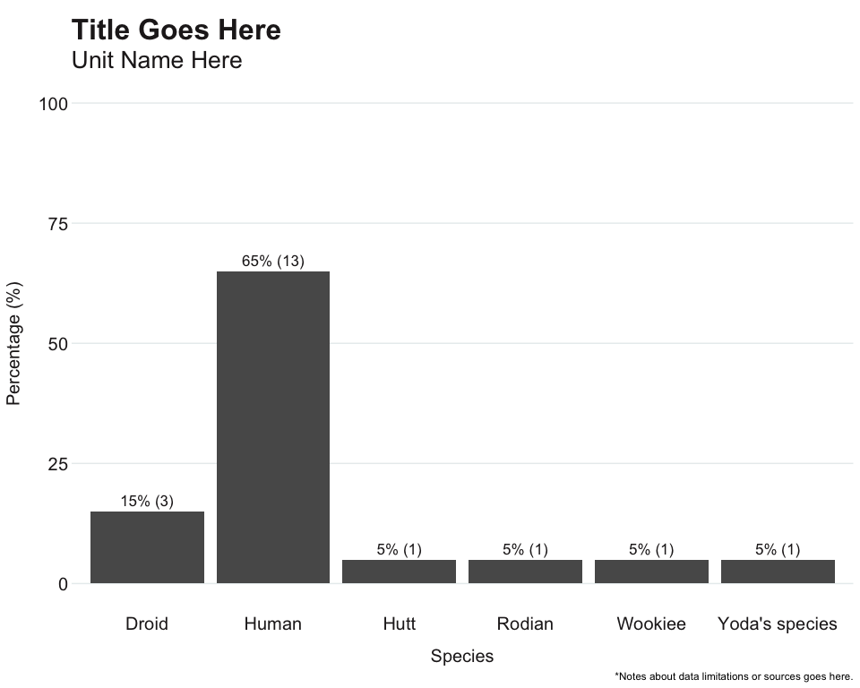

OCepi Package
================

- [Common Data Cleaning Functions](#common-data-cleaning-functions)
  - [Add Percent](#add-percent)
  - [Suppress Small Cell Sizes](#suppress-small-cell-sizes)
  - [Crude Incidence Rate](#crude-incidence-rate)
  - [Pretty Words](#pretty-words)
  - [N (%) Labels](#n--labels)
  - [Age Groups](#age-groups)
  - [Recode Gender](#recode-gender)
  - [Recode Race/Ethnicity](#recode-raceethnicity)
  - [Recode Sexual Orientation](#recode-sexual-orientation)
  - [Batch Load CSV Files](#batch-load-csv-files)
  - [Remove Empty Columns](#remove-empty-columns)
  - [Split and Print Dataframe](#split-and-print-dataframe)
  - [Clean Address](#clean-address)
  - [Clean Phone Number](#clean-phone-number)
  - [Recode Census Tract](#recode-census-tract)
  - [Closest City Match](#closest-city-match)
  - [Redact HIV/AIDS Data](#redact-hivaids-data)
  - [Assign Respiratory Season](#assign-respiratory-season)
  - [Complete Dates](#complete-dates)
  - [MMWR Calendar](#mmwr-calendar)
  - [MMWR Week to Week Ending Date](#mmwr-week-to-week-ending-date)
  - [MMWR Week and Year](#mmwr-week-and-year)
  - [Find Month Date](#find-month-date)
  - [Total Disease Weeks](#total-disease-weeks)
  - [Find Week Ending Date](#find-week-ending-date)
- [VRBIS Functions](#vrbis-functions)
  - [Recode Manner of Death](#recode-manner-of-death)
  - [Recode Place of Death](#recode-place-of-death)
  - [Algorithm for Death Certificate
    Inclusion](#algorithm-for-death-certificate-inclusion)
- [CAIR2 Functions](#cair2-functions)
  - [Baby First Name](#baby-first-name)
- [R Markdown Templates](#r-markdown-templates)
  - [Workflow Documentation](#workflow-documentation)
- [Data Visualizations](#data-visualizations)
  - [Apollo ggplot2 theme](#apollo-ggplot2-theme)


<br>

[](https://github.com/ericmshearer/OCepi/actions/workflows/R-CMD-check.yaml)

**Last Updated:** 02/02/2024

This document provides an overview of the available data cleaning
functions in the OCepi package. Any issues/bugs found please contact
<eshearer@ochca.com>.

## Common Data Cleaning Functions

### Add Percent

Add proportion column to frequency table. Default arguments `digits` set
to 1 and `multiply` to TRUE.

``` r
starwars %>%
  filter(!is.na(species)) %>%
  head(20) %>%
  count(species) %>%
  mutate(percent = add_percent(n, digits = 1, multiply = TRUE))
## # A tibble: 6 × 3
##   species            n percent
##   <chr>          <int>   <dbl>
## 1 Droid              3      15
## 2 Human             13      65
## 3 Hutt               1       5
## 4 Rodian             1       5
## 5 Wookiee            1       5
## 6 Yoda's species     1       5
```

<br>

### Suppress Small Cell Sizes

Mask values/counts below a specified threshold. Default for `threshold`
set to 5.

``` r
df <- starwars %>%
  head(20) %>%
  count(species)

df <- df %>%
  mutate(suppressed = suppress(df$n, threshold = 5, replace_with = "**"))

print(df)
## # A tibble: 6 × 3
##   species            n suppressed
##   <chr>          <int> <chr>     
## 1 Droid              3 **        
## 2 Human             13 13        
## 3 Hutt               1 **        
## 4 Rodian             1 **        
## 5 Wookiee            1 **        
## 6 Yoda's species     1 **
```

<br>

### Crude Incidence Rate

Calculate crude incidence rate per 100,000.

``` r
starwars %>%
  head(20) %>%
  count(species) %>%
  mutate(rate = rate_per_100k(n, 320000, digits = 1))
## # A tibble: 6 × 3
##   species            n  rate
##   <chr>          <int> <dbl>
## 1 Droid              3   0.9
## 2 Human             13   4.1
## 3 Hutt               1   0.3
## 4 Rodian             1   0.3
## 5 Wookiee            1   0.3
## 6 Yoda's species     1   0.3
```

<br>

### Pretty Words

Convert messy string to title casing.

``` r
test_string = "MeSsY dAtA gIvEs Me A hEaDaChe"

pretty_words(test_string)
## [1] "Messy Data Gives Me A Headache"
```

<br>

### N (%) Labels

Create labels for use in dashboards or plots. Use argument `reverse` to
control order of “n” and “%”.

``` r
starwars %>%
  filter(!is.na(species)) %>%
  head(20) %>%
  count(species) %>%
  mutate(
    percent = add_percent(n),
    label = n_percent(n, percent, reverse = TRUE)
    )
## # A tibble: 6 × 4
##   species            n percent label   
##   <chr>          <int>   <dbl> <chr>   
## 1 Droid              3      15 15% (3) 
## 2 Human             13      65 65% (13)
## 3 Hutt               1       5 5% (1)  
## 4 Rodian             1       5 5% (1)  
## 5 Wookiee            1       5 5% (1)  
## 6 Yoda's species     1       5 5% (1)
```

<br>

### Age Groups

Recode age to groups using presets. Output set to factor to maintain
order. Current options:

- **census zip:** 0-4, 5-9, 10-14, 15-17, 18-19, 20, 21, 22-24, 25-29,
  30-34, 35-39, 40-44, 45-49, 50-54, 55-59, 60-61, 62-64, 65-66, 67-69,
  70-74, 75-79, 80-84, 85+
- **covid:** 0-17, 18-24, 25-34, 35-44, 45-54, 55-64, 65-74, 75-84, 85+
- **decade:** 0-9, 10-19, 20-29, 30-39, 40-49, 50-59, 60-69, 70-79, 80+
- **enteric:** 0-4, 5-14, 15-24, 25-44, 45-64, 65+
- **flu vax:** 0-18, 19-49, 50-64, 65+
- **hcv:** 0-17, 18-29, 30-39, 40-49, 50+
- **mpox:** 0-15, 16-24, 25-34, 35-44, 45-54, 55-64, 65+
- **school:** 0-4, 5-11, 12-17, 18-64, 65+
- **wnv:** 0-17, 18-24, 25-34, 35-44, 45-54, 55-64, 65+

Note: census zip should match age groups found in Decennial Census when
pulling data at the zip code level. If you’d like to add a preset,
please contact <eshearer@ochca.com>.

``` r
df <- data.frame(Ages = sample(0:99, 200, replace = TRUE))
df$agegroup <- age_groups(df$Ages, type = "decade")

count(df, agegroup)
##   agegroup  n
## 1      0-9 13
## 2    10-19 18
## 3    20-29 18
## 4    30-39 17
## 5    40-49 20
## 6    50-59 23
## 7    60-69 21
## 8    70-79 18
## 9      80+ 52
```

<br>

### Recode Gender

Applicable to CalREDIE, VRBIS, and CAIR2, but may be applied when gender
is abbreviated as single character.

``` r
recode_gender("F")
## [1] "Female"

recode_gender("TM")
## [1] "Transgender man"

recode_gender(NA)
## [1] "Missing/Unknown"
```

<br>

### Recode Race/Ethnicity

Applicable to CalREDIE, CAIR2, and VRBIS (Multi-race Status variable).
Hierarchy defaults to Hispanic/Latinx regardless of reported race. Can
also accept LOINC codes for Race as input. If using ethnicity and race,
argument order should be `recode_race(ethnicity, race)`.

``` r
recode_race("Hispanic or Latino","Asian") #CalREDIE, 2 inputs
## Hispanic or Latino 
##  "Hispanic/Latinx"

recode_race("Black or African American") #CAIR2, 1 input
## Black or African American 
##  "Black/African American"

recode_race("3") #Multi-race status in VRBIS
##       3 
## "AI/AN"

recode_race("2054-5") #LOINC codes
##                   2054-5 
## "Black/African American"
```

<br>

### Recode Sexual Orientation

Function specifically for CalREDIE. Converts short responses to full.

``` r
recode_orientation("BIS")
## [1] "Bisexual"

recode_orientation(NA)
## [1] "Missing/Unknown"
```

<br>

### Batch Load CSV Files

Input requires list of directory files with full path names. Specify if
your files have column names/headers using `col_names`.

``` r
files <- list.files(path = "G:/file_path/", full.names = TRUE, pattern = ".csv")

df <- batch_load(files, col_names = TRUE)
```

<br>

### Remove Empty Columns

Shrink large datasets by dropping columns that are completely
empty/blank. Message printed to console with total columns dropped.

``` r
df <- data.frame(a = c(NA,NA,NA), b = c("","",""), c = c(1,2,3))
print(df)
##    a b c
## 1 NA   1
## 2 NA   2
## 3 NA   3

df <- remove_empty_cols(df)
## 2 columns dropped.
print(df)
##   c
## 1 1
## 2 2
## 3 3
```

<br>

### Split and Print Dataframe

Ability to take a dataframe, split into smaller dataframes with
specified number of rows, then print as .csv to specified path. Use
`prefix` to set a custom prefix.

``` r
split_df(path = "G:/file_path/", df = test_data, chunks = 200, prefix = "helloworld_")
```

<br>

### Clean Address

Tidy up addresses for geocoding or matching. Use `keep_extra` to
keep/remove apartment, space, unit, etc.

``` r
patient_address = "1234 Main Street Apt 204"

clean_address(patient_address, keep_extra = TRUE)
## [1] "1234 Main Street Apartment 204"

clean_address(patient_address, keep_extra = FALSE)
## [1] "1234 Main Street"
```

<br>

### Clean Phone Number

Tidy up phone numbers to 10 digit U.S. based format.

``` r
#Local Domino's pizza
clean_phone("(714)777-6700")
## [1] "7147776700"

#Best local brewery
clean_phone("(714) 998-8172")
## [1] "7149988172"

 #Apple store in London
clean_phone("+442074471400")
## [1] NA
```

<br>

### Recode Census Tract

Applicable to VRBIS, CAIR2, or any other dataset where census tract
begins with state (e.g. 06 and fips code (e.g. 059). Useful for merging
to shapefiles or health places index dataset.

``` r

recode_ctract("06059099244")
## [1] "099244"
recode_ctract(as.numeric("06059099244"))
## [1] "099244"
```

<br>

### Closest City Match

Convenient row-wise approach to fix misspelled city names. First pass
will look for “homeless”. Second pass will clean-up
neighborhood/non-city names/abbreviations (e.g. HB, El Toro, Capo
Beach). Final pass will compare city to vector of clean city names and
return the closest match. You may adjust the `threshold` but a word of
caution - the higher the value, the more likely a false match.

To run this function, you will need: 1) package stringdist, and 2) a
vector of clean city names (can pull column from dataframe).

``` r
oc_cities <- c("Anaheim","Dana Point","Garden Grove","Lake Forest","Huntington Beach","Orange","Yorba Linda")

df <- data.frame(City = c("Anahem","Gaden Gove","Los Angeles","Hntington Bch"," Ornge","Yerba Linda"))

df %>%
  rowwise() %>%
  mutate(closest_match = closest_city_match(City, oc_cities, threshold = 0.15))
## # A tibble: 6 × 2
## # Rowwise: 
##   City            closest_match   
##   <chr>           <chr>           
## 1 "Anahem"        Anaheim         
## 2 "Gaden Gove"    Garden Grove    
## 3 "Los Angeles"   <NA>            
## 4 "Hntington Bch" Huntington Beach
## 5 " Ornge"        Orange          
## 6 "Yerba Linda"   Yorba Linda
```

<br>

### Redact HIV/AIDS Data

Ability to remove all traces of HIV/AIDS data in a dataframe. If found,
warning message printed to console.

``` r
df <- data.frame(cause = c("cancer","hepatitis","COVID-19","HIV"))
print(df)
##       cause
## 1    cancer
## 2 hepatitis
## 3  COVID-19
## 4       HIV

df <- hiv_redact(df)
## Warning in hiv_redact(df): HIV/AIDS data detected.
print(df)
##       cause
## 1    cancer
## 2 hepatitis
## 3  COVID-19
## 4
```

<br>

### Assign Respiratory Season

Made specifically for respiratory virus surveillance. Function
calculates season in YYYY-YY format from input date. Season is defined
as week 40 of current year to week 39 of following year.

``` r
x = as.Date("2023-10-01")

assign_season(x)
## [1] "2023-24"
```

<br>

### Complete Dates

Fill in missing dates from time series. `Level` options: day, week,
month. Specify `start_date` in case you want time series to begin prior
to the earliest known date.

Month:

``` r
df <- data.frame(
  Dates = c("2023-01-01","2023-02-01","2023-05-01","2023-09-01"),
  Cases = c(2,4,1,6)
  )

df$Dates <- as.Date(df$Dates)

df <- df %>%
  complete_dates(start_date = min(df$Dates), level = "month")

print(df)
##        Dates Cases
## 1 2023-01-01     2
## 2 2023-02-01     4
## 3 2023-03-01    NA
## 4 2023-04-01    NA
## 5 2023-05-01     1
## 6 2023-06-01    NA
## 7 2023-07-01    NA
## 8 2023-08-01    NA
## 9 2023-09-01     6
```

<br>

### MMWR Calendar

Create dataframe with weeks and dates for MMWR year.

``` r
mmwr_calendar(2023) %>%
  head(20)
##    Year Week      Start        End
## 1  2023    1 2023-01-01 2023-01-07
## 2  2023    2 2023-01-08 2023-01-14
## 3  2023    3 2023-01-15 2023-01-21
## 4  2023    4 2023-01-22 2023-01-28
## 5  2023    5 2023-01-29 2023-02-04
## 6  2023    6 2023-02-05 2023-02-11
## 7  2023    7 2023-02-12 2023-02-18
## 8  2023    8 2023-02-19 2023-02-25
## 9  2023    9 2023-02-26 2023-03-04
## 10 2023   10 2023-03-05 2023-03-11
## 11 2023   11 2023-03-12 2023-03-18
## 12 2023   12 2023-03-19 2023-03-25
## 13 2023   13 2023-03-26 2023-04-01
## 14 2023   14 2023-04-02 2023-04-08
## 15 2023   15 2023-04-09 2023-04-15
## 16 2023   16 2023-04-16 2023-04-22
## 17 2023   17 2023-04-23 2023-04-29
## 18 2023   18 2023-04-30 2023-05-06
## 19 2023   19 2023-05-07 2023-05-13
## 20 2023   20 2023-05-14 2023-05-20
```

<br>

### MMWR Week to Week Ending Date

Convert MMWR disease week to week ending date.

``` r
df <- data.frame(
  Year = c(2024,2024,2024,2024),
  Week = c(1:4)
  )%>%
  mutate(week_ending = mmwrweek_to_date(Year, Week))

print(df)
##   Year Week week_ending
## 1 2024    1  2024-01-06
## 2 2024    2  2024-01-13
## 3 2024    3  2024-01-20
## 4 2024    4  2024-01-27
```

<br>

### MMWR Week and Year

Calculate disease week or epidemiological year from any date.

``` r
episode_date = as.Date("2015-01-01")

mmwr_week(episode_date)
## [1] 53

mmwr_year(episode_date)
## [1] 2014
```

<br>

### Find Month Date

Calculate month from input date. Returned format is `YYYY-MM-01`.

``` r
episode_date = as.Date("2015-01-01")

to_month(episode_date)
## [1] "2015-01-01"
```

<br>

### Total Disease Weeks

Calculate total disease weeks for MMWR year.

``` r
total_weeks(2014)
## [1] 53

total_weeks(2023)
## [1] 52
```

<br>

### Find Week Ending Date

Calculate week ending date (Saturday) from input date.

``` r
episode_date = as.Date("2015-01-01")

week_ending_date(episode_date)
## [1] "2015-01-03"
```

<br>

## VRBIS Functions

### Recode Manner of Death

Convert single letter abbreviations to full responses per CCDF data
dictionary. Expects “Manner of Death” column from VRBIS dataset.

``` r
vrbis_manner_death("A")
## [1] "Accident"
vrbis_manner_death(NA)
## [1] "Not specified"
```

<br>

### Recode Place of Death

Convert numeric response to full responses per CCDF data dictionary.
Expects “Place of Death (Facility)” column from VRBIS dataset.

``` r
vrbis_place_death(6)
## [1] "LTCF"
vrbis_place_death("6")
## [1] "LTCF"
```

<br>

### Algorithm for Death Certificate Inclusion

Standardized method to determine if death belongs to local health
jurisdiction. You will need to know your county fips code and county
code from appendix G of CCDF data dictionary.

``` r
df <- df %>%
  mutate(lhj_resident = vrbis_resident(place_of_death, county_of_death_code, decedents_county_of_residence_NCHS_Code, fips = "059", county = "30"))) %>%
  filter(lhj_resident == 1)
```

<br>

## CAIR2 Functions

### Baby First Name

Remove iterations of “baby” from recipient first name.

``` r
baby_name("BABYBOY")
## [1] NA

baby_name("Twin Girl")
## [1] NA
```

<br>

## R Markdown Templates

### Workflow Documentation

For all projects, including routine surveillance analysis, use workflow
template to explain what/how your script works. Once a R Project is
created, go to File \> New File \> R Markdown. Select “From Template”,
then “Epi Workflow”. Keep this file in your main project directory in
case another epidemiologist needs to run script as backup.

## Data Visualizations

### Apollo ggplot2 theme

Standard ggplot2 theme `theme_apollo()`. For horizontal plots, set
`direction` to “horiztonal”.

<!-- -->
