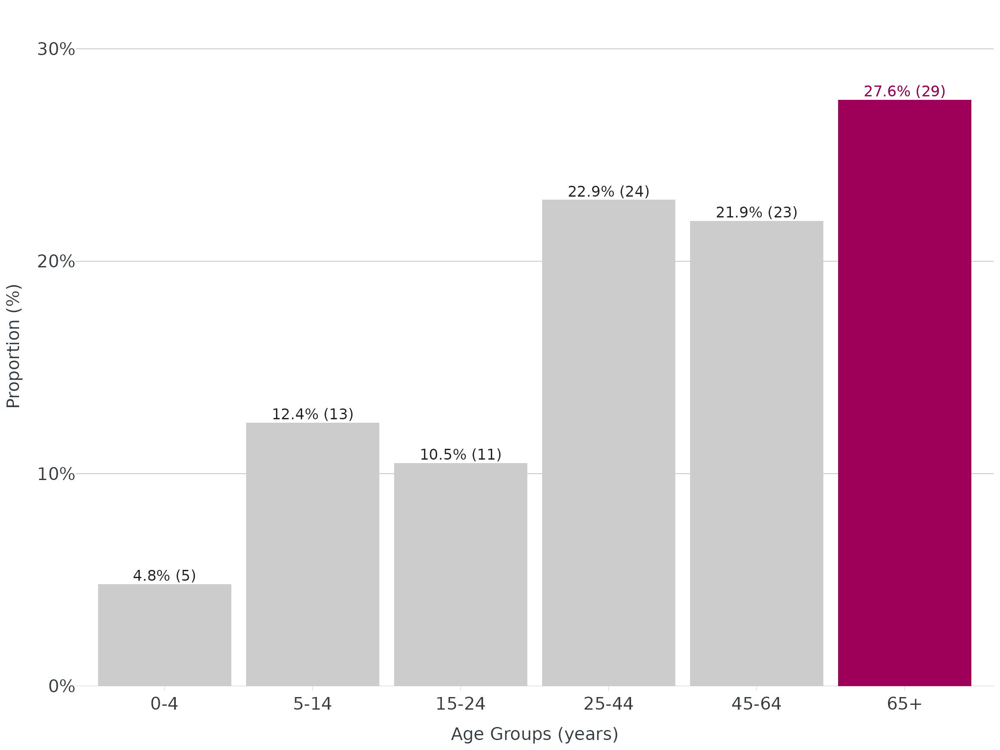
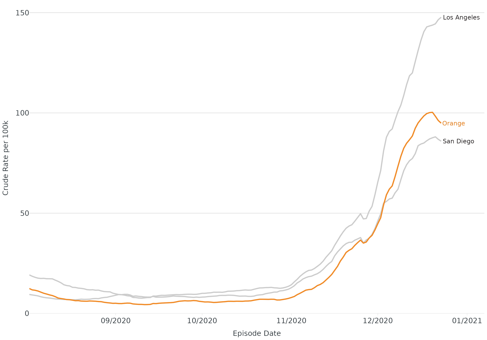

# extending-ggplot2

This article will demonstrate the different ways we extend ggplot2
through themes, colors, and labels.

## theme_apollo() & apollo_label()

Using the built-in linelist dataset, we’ll build a plot using our theme,
labels, and colors:

``` r
dis_x <- linelist

dis_x |>
  mutate(age_groups = age_groups(Age, type = "hcv")) |>
  count(age_groups) |>
  ggplot(aes(x = age_groups, y = n)) +
  geom_bar(stat = "identity", fill = cdcd_color("dodgers")) +
  theme_apollo() +
  apollo_label(aes(label = n), vjust = -0.3) +
  scale_y_continuous(expand = c(0,0), limits = c(0,50)) +
  labs(
    title = "Disease X by Age Group",
    subtitle = "PHS/Communicable Disease Control",
    x = "Age Group (years)",
    y = "Total Cases",
    caption = "*This is a caption."
  )
```


For horizontal plots or maps, update
`theme_apollo(direction = "horizontal")` or
`theme_apollo(direction = "map")` respectively.

## cdcd_color()

Color palette below contains our favorite/most used colors:


## end_points()

For line plots with \>1 group, it is recommended to direct label groups.
[`end_points()`](https://ericmshearer.github.io/OCepi/reference/end_points.md)
will subset the data to the last date in a time series, even if groups
end at different dates (thank you Butte County for the suggestion).

``` r
covid <- read.csv("https://data.chhs.ca.gov/dataset/f333528b-4d38-4814-bebb-12db1f10f535/resource/046cdd2b-31e5-4d34-9ed3-b48cdbc4be7a/download/covid19cases_test.csv", na.strings = "", stringsAsFactors = FALSE) |>
  filter(area %in% c("Orange","Los Angeles","San Diego"))

covid <- covid |>
  group_by(area) |>
  mutate(
    date = as.Date(date, "%Y-%m-%d"),
    rate = rate_per_100k(cases, population, digits = 1),
    rate_ma_7 = round(zoo::rollmean(rate, k = 7, align = "right", na.pad = FALSE, fill = 0), digits = 2)
  ) |>
  ungroup() |>
  filter(date <= "2020-12-23", date > "2020-08-01")

ggplot(data = covid, aes(x = date, y = rate_ma_7, color = area)) +
  geom_line(linewidth = 1.2) +
  theme_apollo(legend = "Hide") +
  geom_text(data = end_points(covid, date = date), aes(label = area), hjust = -0.05, show.legend = FALSE, size = 4.5) +
  scale_x_date(date_labels = "%m/%Y", date_breaks = "1 month", expand = expansion(add = c(0,15))) +
  scale_y_continuous(expand = c(0,0), limits = c(0,155)) +
  labs(
    x = "Episode Date",
    y = "Crude Rate per 100k",
    color = "County"
  ) +
  scale_color_manual(values = cdcd_color("dodgers","mustard","london pink"))
```


## wrap_labels()

For categories with long titles (e.g. race/ethnicity), you may need to
wrap text to better fit under/next to the axis. Functions like
[`scales::label_wrap()`](https://scales.r-lib.org/reference/label_wrap.html)
are very useful in wrapping long labels via width argument. Our function
will wrap label at whatever delimiter you specify (e.g. or, forward
slash, hyphen, etc.)

Without wrapping:

``` r
re <- data.frame(group = c("Native Hawaiian or Other Pacific Islander","Black or African American","American Indian/Alaska Native"), score = c(89.5, 84, 73))

ggplot(data = re, aes(x = group, y = score, label = score)) +
  geom_col() +
  theme_apollo() +
  scale_y_continuous(expand = c(0,0), limits = c(0,100)) +
  labs(
    x = "Race/Ethnicity",
    y = "Percentage (%)"
  ) +
  apollo_label(vjust = -0.3)
```


With wrapping:

``` r
ggplot(data = re, aes(x = group, y = score, label = score)) +
  geom_col() +
  scale_x_discrete(labels = wrap_labels(delim = c("or","/"))) +
  theme_apollo() +
  scale_y_continuous(expand = c(0,0), limits = c(0,100)) +
    labs(
    x = "Race/Ethnicity",
    y = "Percentage (%)"
  ) +
  apollo_label(vjust = -0.3)
```


## highlight_geom() & desaturate_geom()

When making data visualizations, emphasizing data points through
highlighting/fading may help the viewer see the take home message.
{OCepi} providers two ways to do this:
[`highlight_geom()`](https://ericmshearer.github.io/OCepi/reference/highlight_geom.md)
and
[`desaturate_geom()`](https://ericmshearer.github.io/OCepi/reference/desaturate_geom.md).
[`highlight_geom()`](https://ericmshearer.github.io/OCepi/reference/highlight_geom.md)
requires two basic arguments - 1) an expression (similar to what you’d
use in
[`dplyr::filter()`](https://dplyr.tidyverse.org/reference/filter.html)),
and 2) a color for highlighting. Although sensible defaults are
built-in, the following additional arguments within
[`highlight_geom()`](https://ericmshearer.github.io/OCepi/reference/highlight_geom.md)
can be customized:

- size (`geom_point()`)
- linewidth (`geom_line()`, `geom_sf()`)

Please note: the default fade color/fill for
[`highlight_geom()`](https://ericmshearer.github.io/OCepi/reference/highlight_geom.md)
is light grey (#cccccc). To override, add fill/color to `geom_*`
(e.g. `geom_line(color = "black")`.

[`desaturate_geom()`](https://ericmshearer.github.io/OCepi/reference/desaturate_geom.md)
requires the same two basic arguments as
[`highlight_geom()`](https://ericmshearer.github.io/OCepi/reference/highlight_geom.md)
plus `desaturate` (range 0-1, 1 highest level of desaturation). Instead
of fading non-emphasized categories to gray, they will retain color but
be desaturated. Options to customize include:

- size (points)
- linewidth (`geom_line()`, `geom_sf()`)

Both highlighting approaches work with `facet_wrap()` and
`facet_grid()`. Currently works with `geom_col()`/`geom_bar()`,
`geom_line()`, `geom_sf()`, and `geom_point()`. Please note: your labels
will be highlighted if you place the text/label function before the
highlight/desaturate function. If you don’t want your labels
highlighted, placed labels after highlight/desaturate function.

#### Bar - Highlight

``` r
tbl <- linelist |>
  mutate(age_groups = age_groups(Age, type = "enteric")) |>
  count(age_groups) |>
  mutate(
    percent = add_percent(n, digits = 1),
    label = n_percent(n, percent, reverse = TRUE)
  )

ggplot(data = tbl, aes(x = age_groups, y = percent)) +
  geom_col() +
  apollo_label(data = tbl, aes(label = label), vjust = -0.3) +
  highlight_geom(percent == max(percent), pal = cdcd_color("london pink")) +
  scale_y_continuous(expand = c(0,0), limits = c(0,32), label = scales::label_percent(scale = 1)) +
  theme_apollo() +
  labs(
    x = "Age Groups (years)",
    y = "Proportion (%)"
  )
```



#### Line - highlight

``` r
ggplot(data = covid, aes(x = date, y = rate_ma_7, group = area)) +
  geom_line(linewidth = 1.2) +
  theme_apollo(legend = "Hide") +
  apollo_label(data = end_points(covid, date = date), aes(label = area), hjust = -0.05) +
  highlight_geom(area == "Orange", pal = cdcd_color("orange")) +
  scale_x_date(date_labels = "%m/%Y", date_breaks = "1 month", expand = expansion(add = c(0,15))) +
  scale_y_continuous(expand = c(0,0), limits = c(0,155)) +
  labs(
    x = "Episode Date",
    y = "Crude Rate per 100k",
    color = "County"
  )
#> Ignoring unknown labels:
#> • colour : "County"
```



#### Shapefile/Map - desaturate

``` r
base_zip <- oc_zip_sf

ggplot(data = oc_zip_sf) +
  geom_sf() +
  desaturate_geom(Zip %in% c(92702:92708), pal = cdcd_color("dodgers"), desaturate = 0.75, linewidth = 0.5) +
  geom_sf_text(data = base_zip, aes(label = Zip)) +
  theme_apollo(direction = "map")
```


