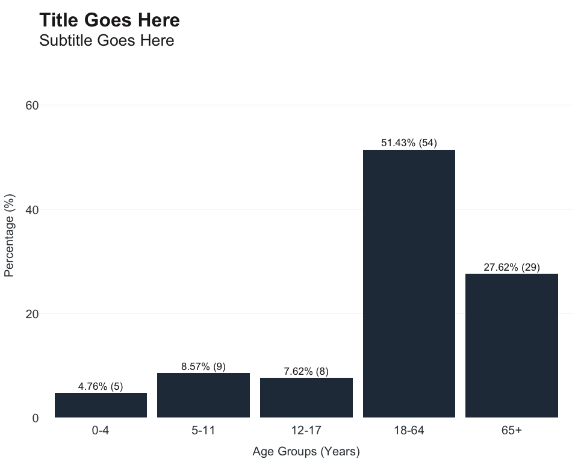

OCepi - Vignette
================

- [Data Cleaning](#data-cleaning)
  - [Recoding](#recoding)
  - [Misc Recoding](#misc-recoding)
  - [VRBIS](#vrbis)
- [Data Masking](#data-masking)
  - [Suppression](#suppression)
  - [Redaction](#redaction)
- [Common Epidemiological Date
  Conversions](#common-epidemiological-date-conversions)
  - [MMWR](#mmwr)
  - [Respiratory Season](#respiratory-season)
  - [Month](#month)
- [Data Management](#data-management)
  - [Data.frames](#dataframes)
- [Data Visualizations](#data-visualizations)

The functions in this package were designed to simplify the most
frequent recoding tasks. Patient data is *messy*, often times requiring:
converting abbreviations to full responses, coalescing race and
ethnicity to a unified column, reformatting columns to use in
joins/matching, or grouping patients into time.

The examples below will use simulated outbreak data:

    #> # A tibble: 10 × 6
    #>    Ethnicity             Race  Gender   Age `Sexual Orientation` `Specimen Date`
    #>    <chr>                 <chr> <chr>  <dbl> <chr>                <chr>          
    #>  1 Non-Hispanic or Lati… Mult… M         46 HET                  6/7/2022       
    #>  2 Unknown               Unkn… M          4 HET                  6/9/2022       
    #>  3 Non-Hispanic or Lati… White F         52 UNK                  6/7/2022       
    #>  4 Non-Hispanic or Lati… White F         77 UNK                  6/11/2022      
    #>  5 Unknown               Amer… M         71 HET                  6/10/2022      
    #>  6 Non-Hispanic or Lati… Other M         70 HET                  6/9/2022       
    #>  7 Non-Hispanic or Lati… Blac… F         11 HET                  6/8/2022       
    #>  8 Non-Hispanic or Lati… Blac… F          8 HET                  6/12/2022      
    #>  9 Hispanic or Latino    Amer… F         41 HET                  6/12/2022      
    #> 10 Non-Hispanic or Lati… Blac… M         56 HET                  6/10/2022

## Data Cleaning

### Recoding

Core Functions:

- `recode_race` - able to accept: ethnicity and race, race only, LOINC
  codes, and ‘Multi-race Status’ variable from VRBIS.

  - Use argument `abbr_names` to abbreviate long category names
    i.e. “American Indian or Alaska Native” to “AI/AN” (TRUE/FALSE).

  - If using ethnicity and race, use order
    `recode_race(ethnicity, race)`.

- `recode_gender` - can be used with CalREDIE or VRBIS; aims to use the
  most inclusive terms possible.

- `recode_orientation` - created specifically for CalREDIE. Expects
  CTCIAdtlDemOrient variable.

- `age_groups` - has several presets for grouping age:

  - **census zip** (from decennial)**:** 0-4, 5-9, 10-14, 15-17, 18-19,
    20, 21, 22-24, 25-29, 30-34, 35-39, 40-44, 45-49, 50-54, 55-59,
    60-61, 62-64, 65-66, 67-69, 70-74, 75-79, 80-84, 85+
  - **covid:** 0-17, 18-24, 25-34, 35-44, 45-54, 55-64, 65-74, 75-84,
    85+
  - **decade:** 0-9, 10-19, 20-29, 30-39, 40-49, 50-59, 60-69, 70-79,
    80+
  - **enteric:** 0-4, 5-14, 15-24, 25-44, 45-64, 65+
  - **flu vax:** 0-18, 19-49, 50-64, 65+
  - **hcv:** 0-17, 18-29, 30-39, 40-49, 50+
  - **mpox:** 0-15, 16-24, 25-34, 35-44, 45-54, 55-64, 65+
  - **school:** 0-4, 5-11, 12-17, 18-64, 65+
  - **wnv:** 0-17, 18-24, 25-34, 35-44, 45-54, 55-64, 65+

Example:

``` r
linelist <- linelist %>%
  mutate(
    Gender = recode_gender(Gender),
    race_ethnicity = recode_race(Ethnicity, Race, abbr_names = TRUE),
    age_group = age_groups(Age, type = "school"),
    `Sexual Orientation` = recode_orientation(`Sexual Orientation`)
  )
```

Frequency table with percentage using `add_percent` and incidence rates
using `rate_per_100k`:

``` r
linelist %>%
  count(age_group) %>%
  mutate(
    percent = add_percent(n),
    rate = case_when(
      age_group == "0-4" ~ rate_per_100k(n, 100000, digits = 1),
      age_group == "5-11" ~ rate_per_100k(n, 300000, digits = 1),
      age_group == "12-17" ~ rate_per_100k(n, 500000, digits = 1),
      age_group == "18-64" ~ rate_per_100k(n, 1000000, digits = 1),
      age_group == "65+" ~ rate_per_100k(n, 2000000, digits = 1)
      )
    )
#> # A tibble: 5 × 4
#>   age_group     n percent  rate
#>   <fct>     <int>   <dbl> <dbl>
#> 1 0-4           5     4.8   5  
#> 2 5-11          9     8.6   3  
#> 3 12-17         8     7.6   1.6
#> 4 18-64        54    51.4   5.4
#> 5 65+          29    27.6   1.4
```

### Misc Recoding

There are several minor recoding functions available:

- `recode_ctract` - removes state (##) and county fips code (###) from
  census tract
- `clean_phone` - reformat phone number to U.S. 10 digit number
- `clean_address` - convert string to title casing; use argument
  `keep_extra` to remove(FALSE)/keep(TRUE) apartment, unit, etc.
- `pretty_words` - convert string to title casing

``` r
recode_ctract("06059099244")
#> [1] "099244"

clean_phone("(714) 998-8172")
#> [1] "7149988172"

clean_address("1234 Main Street Apt 204", keep_extra = TRUE)
#> [1] "1234 Main Street Apartment 204"

clean_address("1234 Main Street Apt 204", keep_extra = FALSE)
#> [1] "1234 Main Street"

pretty_words("MeSsY dAtA gIvEs Me A hEaDaChe")
#> [1] "Messy Data Gives Me A Headache"
```

### VRBIS

Core functions:

- `vrbis_manner_death` - expects “Manner of Death” variable, follows
  CCDF data dictionary
- `vrbis_place_death` - expects “Place of Death (Facility)”, follows
  CCDF data dictionary
- `vrbis_resident` - determine if death belongs to your local health
  jurisdiction

``` r
vrbis_manner_death("A")
#> [1] "Accident"

vrbis_place_death(6)
#> [1] "LTCF"
```

To use `vrbis_resident`, you will need to know your county fips code and
CCDF county code (from appendix G). Returned output is 0/1 where 1
indicates death belongs to your county. For columns, you’ll need (in
order): “Place of Death (Facility)”, “County of Death (Code)”,
“Decedents County of Residence (NCHS Code)”. Next, plug in your fips
code to `fips` and CCDF county code to `county` arguments.

``` r
df <- df %>%
  mutate(
    lhj_resident = vrbis_resident(
      place_of_death,
      county_of_death_code,
      decedents_county_of_residence_NCHS_Code,
      fips = "059",
      county = "30"
      )
    ) %>%
  filter(lhj_resident == 1)
```

## Data Masking

### Suppression

Small cell sizes may need to be suppressed to protect patient
confidentiality prior to reporting. In this example, any cell sizes
`less_than` 10 will be suppressed and `replace_with` double asterisk.

``` r
linelist %>% count(age_group) %>% mutate(n_suppress = suppress(n, less_than = 10, replace_with = "**"))
#> # A tibble: 5 × 3
#>   age_group     n n_suppress
#>   <fct>     <int> <chr>     
#> 1 0-4           5 **        
#> 2 5-11          9 **        
#> 3 12-17         8 **        
#> 4 18-64        54 54        
#> 5 65+          29 29
```

### Redaction

Depending on unit/program policy, any mention of HIV or AIDS may need to
be removed from the dataset. While not yet exhaustive, this function
accounts for several variations of HIV and AIDS. If found, a warning
message is printed to the console.

``` r
df <- data.frame(cause = c("cancer","hepatitis","COVID-19","HIV"))
print(df)
#>       cause
#> 1    cancer
#> 2 hepatitis
#> 3  COVID-19
#> 4       HIV

df <- hiv_redact(df)
#> Warning in hiv_redact(df): HIV/AIDS data detected.
print(df)
#>       cause
#> 1    cancer
#> 2 hepatitis
#> 3  COVID-19
#> 4
```

## Common Epidemiological Date Conversions

### MMWR

Core Functions:

- `mmwr_year` - calculate epidemiological year
- `mmwr_week` - calculate epidemiological week (or disease week)
- `week_ending_date` - calculate Saturday of disease week
- `mmwr_calendar` - returns data.frame with columns for disease week,
  week start and end date, for a given epidemiological year
- `mmwrweek_to_date` - calculate week ending date from epidemiological
  year and week

``` r
dates <- linelist %>%
  select(`Specimen Date`) %>%
  mutate(`Specimen Date` = as.Date(`Specimen Date`, format = "%m/%d/%Y")) %>%
  arrange(`Specimen Date`) %>%
  mutate(
    epi_year = mmwr_year(`Specimen Date`),
    disease_week = mmwr_week(`Specimen Date`),
    week_ending = week_ending_date(`Specimen Date`)
  )

head(dates)
#> # A tibble: 6 × 4
#>   `Specimen Date` epi_year disease_week week_ending
#>   <date>             <dbl>        <dbl> <date>     
#> 1 2022-06-04          2022           22 2022-06-04 
#> 2 2022-06-04          2022           22 2022-06-04 
#> 3 2022-06-04          2022           22 2022-06-04 
#> 4 2022-06-05          2022           23 2022-06-11 
#> 5 2022-06-05          2022           23 2022-06-11 
#> 6 2022-06-06          2022           23 2022-06-11
```

Convert epidemiological year and week to week ending date:

``` r
dates <- dates %>%
  select(epi_year, disease_week) %>%
  mutate(
    week_ending = mmwrweek_to_date(epi_year, disease_week)
  )

head(dates)
#> # A tibble: 6 × 3
#>   epi_year disease_week week_ending
#>      <dbl>        <dbl> <date>     
#> 1     2022           22 2022-06-04 
#> 2     2022           22 2022-06-04 
#> 3     2022           22 2022-06-04 
#> 4     2022           23 2022-06-11 
#> 5     2022           23 2022-06-11 
#> 6     2022           23 2022-06-11
```

To make `mmwr_calendar` with total disease weeks + start/end dates:

``` r
mmwr_calendar(2023) %>%
  head(20)
#>    Year Week      Start        End
#> 1  2023    1 2023-01-01 2023-01-07
#> 2  2023    2 2023-01-08 2023-01-14
#> 3  2023    3 2023-01-15 2023-01-21
#> 4  2023    4 2023-01-22 2023-01-28
#> 5  2023    5 2023-01-29 2023-02-04
#> 6  2023    6 2023-02-05 2023-02-11
#> 7  2023    7 2023-02-12 2023-02-18
#> 8  2023    8 2023-02-19 2023-02-25
#> 9  2023    9 2023-02-26 2023-03-04
#> 10 2023   10 2023-03-05 2023-03-11
#> 11 2023   11 2023-03-12 2023-03-18
#> 12 2023   12 2023-03-19 2023-03-25
#> 13 2023   13 2023-03-26 2023-04-01
#> 14 2023   14 2023-04-02 2023-04-08
#> 15 2023   15 2023-04-09 2023-04-15
#> 16 2023   16 2023-04-16 2023-04-22
#> 17 2023   17 2023-04-23 2023-04-29
#> 18 2023   18 2023-04-30 2023-05-06
#> 19 2023   19 2023-05-07 2023-05-13
#> 20 2023   20 2023-05-14 2023-05-20
```

### Respiratory Season

For epidemiologists working viral respiratory surveillance,
patients/laboratory results can also be categorized by season. Season in
this context spans week 40 of current year to week 39 of following year.

``` r
df <- data.frame(spec_date = as.Date(c("2023-10-01","2023-11-04","2024-09-28","2024-09-29")))

df %>% mutate(season = assign_season(spec_date))
#>    spec_date  season
#> 1 2023-10-01 2023-24
#> 2 2023-11-04 2023-24
#> 3 2024-09-28 2023-24
#> 4 2024-09-29 2024-25
```

### Month

An alternative to grouping cases at the year or week level is by month.
Returned output is a date formatted YYYY-MM-01.

``` r
df <- data.frame(spec_date = as.Date(c("2023-10-01","2023-11-04","2024-09-28","2024-09-29")))

df %>% mutate(month = to_month(spec_date))
#>    spec_date      month
#> 1 2023-10-01 2023-10-01
#> 2 2023-11-04 2023-11-01
#> 3 2024-09-28 2024-09-01
#> 4 2024-09-29 2024-09-01
```

## Data Management

### Data.frames

`batch_load` imports all .CSV files from a directory into unified
data.frame (assumes files have matching columns). Specify if your files
have `col_names`.

``` r
files <- list.files(path = "G:/file_path/", full.names = TRUE, pattern = ".csv")

df <- batch_load(files, col_names = TRUE)
```

`remove_empty_cols` drops all columns from data.frame that are blank
(represented by `NA` or ““)

``` r
df <- data.frame(a = c(NA,NA,NA), b = c("","",""), c = c(1,2,3))
print(df)
#>    a b c
#> 1 NA   1
#> 2 NA   2
#> 3 NA   3

df <- remove_empty_cols(df)
#> 2 columns dropped.
print(df)
#>   c
#> 1 1
#> 2 2
#> 3 3
```

## Data Visualizations

Core functions:

- `theme_apollo` - standardized branding for plots across the
  surveillance branches
- `apollo_label` - labels that match branding aesthetic
- `n_percent` - format labels using frequency and percentage to improve
  clarity

Basic plot using ggplot2:

``` r
linelist %>%
  count(age_group) %>%
  ggplot(aes(x = age_group, y = n)) +
  geom_col()
```

<!-- -->

Applying `theme_apollo`, `apollo_label`, and `n_percent` for labels.
Note: when using `coord_flip` for horizontal bar charts, set `direction`
to “horizontal”.

``` r
linelist %>%
  count(age_group) %>%
  mutate(
    percent = add_percent(n),
    label = n_percent(n, percent, reverse = TRUE)
  ) %>%
  ggplot(aes(x = age_group, y = percent, label = label)) +
  geom_col(fill = "#283747") +
  scale_y_continuous(expand = c(0,0), limits = c(0,70)) +
  theme_apollo(direction = "vertical") +
  labs(
    title = "Title Goes Here",
    subtitle = "Subtitle Goes Here",
    x = "Age Groups (Years)",
    y = "Percentage (%)"
  ) +
  apollo_label(direction = "vertical")
```

<!-- -->
