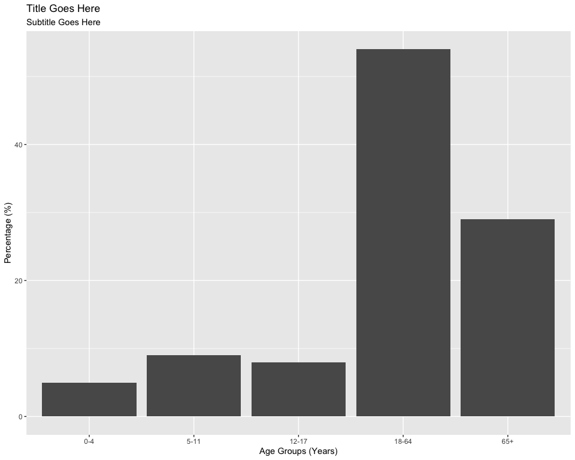
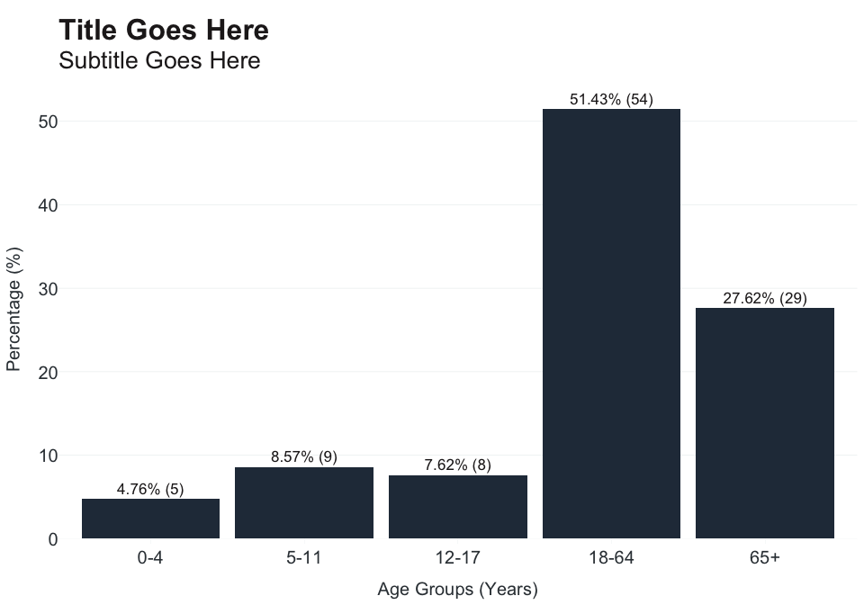
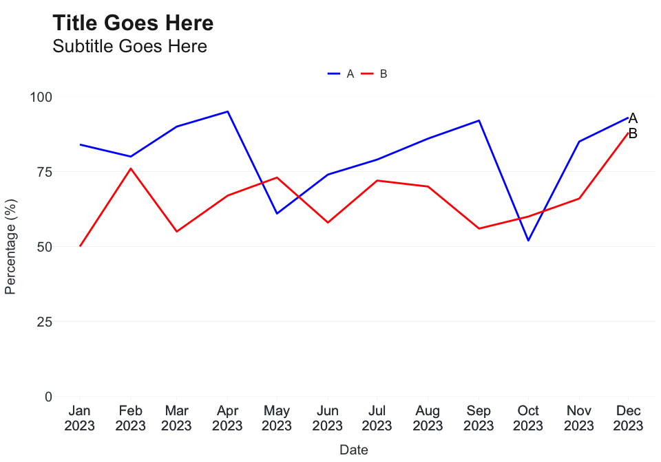
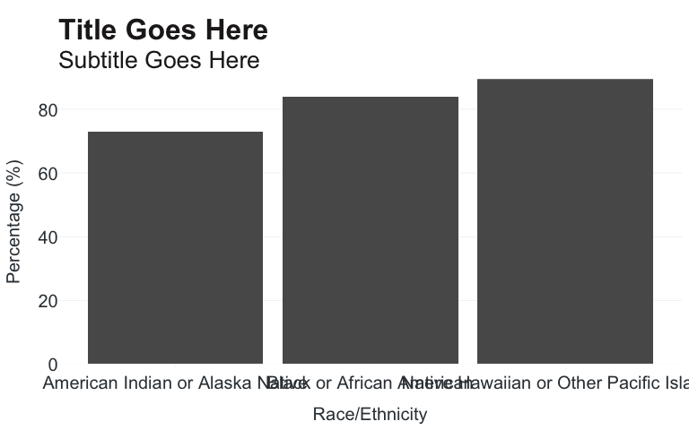
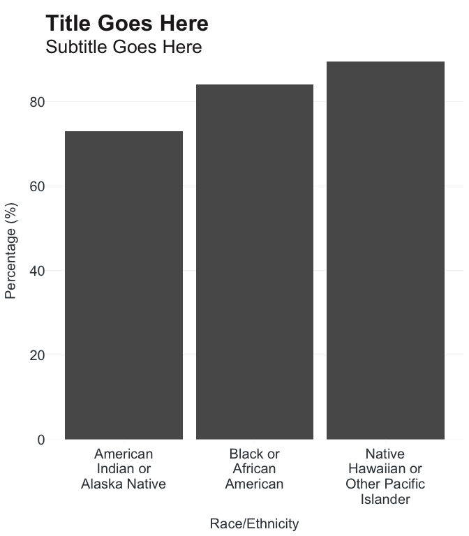
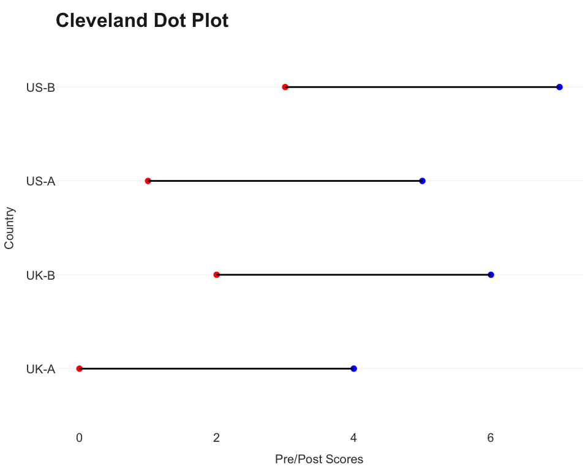
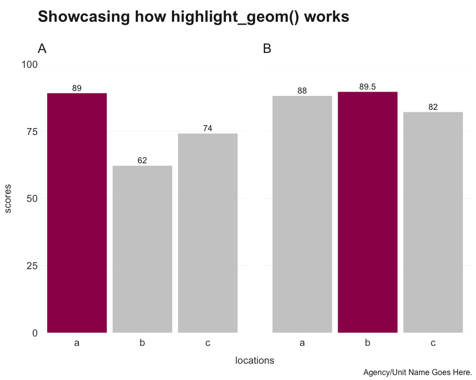

Extending ggplot2
================

- [Extending ggplot2](#extending-ggplot2)
  - [theme_apollo & apollo_label](#theme_apollo--apollo_label)
  - [Get line plot label data](#get-line-plot-label-data)
  - [Wrap long axis labels](#wrap-long-axis-labels)
  - [Dumbbell-style Plot](#dumbbell-style-plot)
  - [Highlight Group of Interest](#highlight-group-of-interest)

# Extending ggplot2

Core functions:

- `theme_apollo` - minimal, clean theme for plots
- `apollo_label` - labels that match branding aesthetic
- `end_points` - subset data at last time series data point for labeling
  line plots
- `wrap_labels` - wrap long axis labels to better fit plot
- `geom_cleveland` - dumbbell-style plot
- `highlight_geom` - highlight geom\_\* of interest based on expression

## theme_apollo & apollo_label

Basic plot using ggplot2:

``` r
linelist %>%
  count(age_group) %>%
  ggplot(aes(x = age_group, y = n)) +
  geom_col() +
    labs(
    title = "Title Goes Here",
    subtitle = "Subtitle Goes Here",
    x = "Age Groups (Years)",
    y = "Percentage (%)"
  )
```

<!-- -->

Now we apply `theme_apollo` and `apollo_label`. Note: when using
`coord_flip` for horizontal bar charts, set `direction` to “horizontal”
for both `theme_apollo` and `apollo_label`.

``` r
linelist %>%
  count(age_group) %>%
  mutate(
    percent = add_percent(n),
    label = n_percent(n, percent, reverse = TRUE)
  ) %>%
  ggplot(aes(x = age_group, y = percent, label = label)) +
  geom_col(fill = "#283747") +
  scale_y_continuous(expand = c(0,0), limits = c(0,55)) +
  theme_apollo(direction = "vertical") +
  labs(
    title = "Title Goes Here",
    subtitle = "Subtitle Goes Here",
    x = "Age Groups (Years)",
    y = "Percentage (%)"
  ) +
  apollo_label(direction = "vertical")
```

<!-- -->

## Get line plot label data

In some cases, you may want to add labels at the end of a line plot to
increase readability. The simplest way to get the data from the last
point in a time series is to put filtered data into `geom_text`:

``` r
ggplot(data = ts, aes(x = date, y = scores, group = site)) +
  geom_line(aes(colour=site), linewidth = 1) +
  scale_x_date(breaks = ts$date, date_labels = "%b\n%Y") +
  scale_y_continuous(expand = c(0,0), limits = c(0,100)) +
  theme_apollo() +
  scale_colour_manual(values = c(A="blue",B="red")) +
  geom_text(data = end_points(ts, date), aes(label = site), hjust = 0, size = 5.5) +
    labs(
    title = "Title Goes Here",
    subtitle = "Subtitle Goes Here",
    x = "Date",
    y = "Percentage (%)"
  )
```

<!-- -->

## Wrap long axis labels

For categories with long titles (e.g. race/ethnicity), you may need the
option to wrap text to better fit under/next to the axis. To specify
amount of wrapping, use `width` argument to adjust (lower width = more
wrapping, higher width = less wrapping).

Without wrapping:

``` r
ggplot(data = re, aes(x = group, y = score)) +
  geom_col() +
  theme_apollo() +
  scale_y_continuous(expand = c(0,0)) +
  labs(
    title = "Title Goes Here",
    subtitle = "Subtitle Goes Here",
    x = "Race/Ethnicity",
    y = "Percentage (%)"
  )
```

<!-- -->

With wrapping:

``` r
ggplot(data = re, aes(x = group, y = score)) +
  geom_col() +
  scale_x_discrete(labels = wrap_labels(width = 15)) +
  theme_apollo() +
  scale_y_continuous(expand = c(0,0)) +
    labs(
    title = "Title Goes Here",
    subtitle = "Subtitle Goes Here",
    x = "Race/Ethnicity",
    y = "Percentage (%)"
  )
```

<!-- -->

## Dumbbell-style Plot

Cleveland dot plot, also called dumbbell plots, consist of two points
connected by a solid line. Useful in showing changes in pre/post test
scores or timelines. Dataset requires two x variables (x and xend), y
variable (character/factor). Speciy within `geom_cleveland`: point
colours (colour_x and colour_xend), line thickness (linewidth), and
point size (size_x).

``` r
ggplot(data = cleveland, aes(x = PRE, xend = POST, y = Country)) +
  geom_cleveland(colour_x = "red", colour_xend = "blue") +
  labs(title = "Cleveland Dot Plot", x = "Pre/Post Scores", y = "Country") +
  OCepi::theme_apollo()
```

<!-- -->

## Highlight Group of Interest

In plots with multiple categories, you may want to draw attention to a
specific group - whether it’s the highest/lowest value, a group of
interest, etc. `highlight_geom` takes two arguments - an expression
(similar to what you’d use in `dplyr::filter`), and a color for
highlighting. The highlighting does work with facets, but this function
should be considered experimental and to be used with caution. Currently
works well with `geom_col`/`geom_bar`, `geom_line`, and `geom_point`.

``` r
ggplot(data = highlight, aes(x = locations, y = scores)) +
  geom_col() +
  facet_grid(~site) +
  highlight_geom(scores==max(scores), pal = "#9E0059") +
  scale_y_continuous(expand = c(0,0), limits = c(0,100)) +
  OCepi::theme_apollo(direction = "vertical") +
  labs(
    title = "Showcasing how highlight_geom() works\n",
    caption = "Agency/Unit Name Goes Here."
  ) +
  OCepi::apollo_label(data = highlight, aes(label = scores), direction = "vertical")
#> Warning: The `.dots` argument of `group_by()` is deprecated as of dplyr 1.0.0.
#> ℹ The deprecated feature was likely used in the dplyr package.
#>   Please report the issue at <https://github.com/tidyverse/dplyr/issues>.
#> This warning is displayed once every 8 hours.
#> Call `lifecycle::last_lifecycle_warnings()` to see where this warning was
#> generated.
```

<!-- -->
